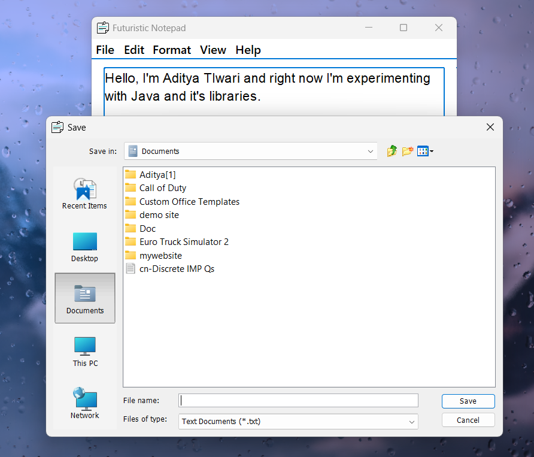
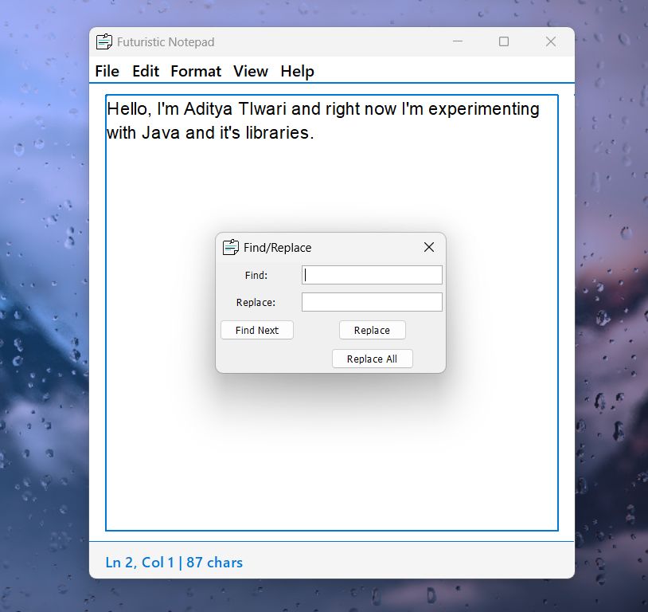
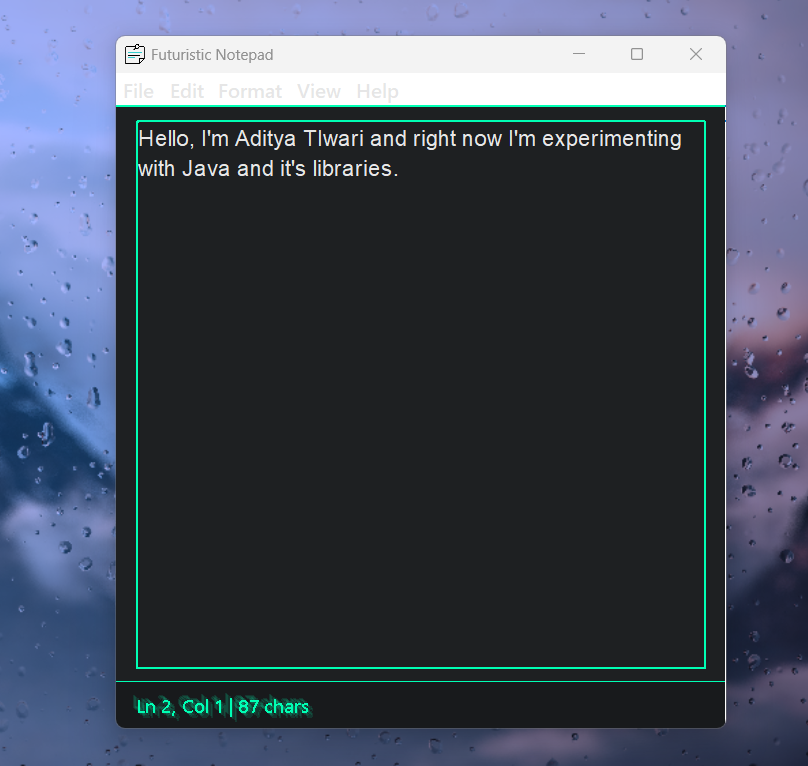

# Futuristic Notepad

Futuristic Notepad is a modern, feature-rich text editor built using Java Swing. It provides a sleek user interface with support for dark mode, customizable fonts, and essential text editing features like find/replace, word wrap, and more.

---

## Features

- **File Operations**:
  - Create a new file
  - Open existing `.txt` files
  - Save and Save As functionality
  - Auto-add `.txt` extension for saved files

- **Text Editing**:
  - Cut, Copy, Paste
  - Find and Replace functionality
  - Select All
  - Word Wrap toggle

- **Customization**:
  - Dark Mode toggle
  - Font customization (family and size)

- **User Interface**:
  - MacOS-style borders and scrollbars
  - Status bar showing line, column, and character count
  - Keyboard shortcuts for common actions

- **Help**:
  - About dialog with application details

---

## Installation

1. Clone or download the repository.
2. Ensure you have Java installed (JDK 8 or higher).
3. Compile the `Notepad.java` file:
   ```bash
   javac Notepad.java
   ```
4. Run the application:
   ```bash
   java Notepad
   ```

---

## Keyboard Shortcuts

| Action             | Shortcut         |
|--------------------|------------------|
| New File           | `Ctrl + N`      |
| Open File          | `Ctrl + O`      |
| Save File          | `Ctrl + S`      |
| Exit Application   | `Ctrl + Q`      |
| Cut                | `Ctrl + X`      |
| Copy               | `Ctrl + C`      |
| Paste              | `Ctrl + V`      |
| Find/Replace       | `Ctrl + F`      |
| Select All         | `Ctrl + A`      |

---

## How to Use

1. **File Operations**:
   - Use the `File` menu to create, open, save, or exit the application.
   - The status bar updates with the current file name and character count.

2. **Editing Text**:
   - Use the `Edit` menu for text operations like Cut, Copy, Paste, and Find/Replace.

3. **Customization**:
   - Toggle dark mode from the `View` menu.
   - Customize fonts from the `Format` menu.

4. **Help**:
   - Access the `About` dialog from the `Help` menu for application details.

---

## Screenshots





---

## Known Issues

- None reported yet. Feel free to open an issue if you encounter any bugs.

---

## License

This project is licensed under the MIT License. Feel free to use and modify it as needed.

---

## Author

Developed by **Aditya Tiwari**.  
Powered by **Java Swing**.